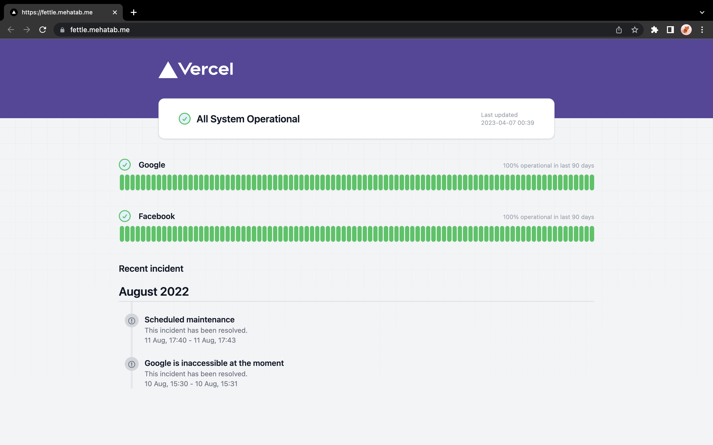

  

# Fettle 💟 

**Fettle** is the open-source status page, powered entirely by GitHub Actions, Issues, and Pages.

# How it works

- Hosting
    - GitHub Pages is used for hosting the status page.

- Monitoring
    - Github Workflow will be triggered every 1 Hr (Configurable) to visit the website.
    - Response status and response time is commited to github repository.

- Incidents
    - Github issue is used for incident management.

# Contributing
Feel free to submit pull requests and/or file issues for bugs and suggestions.